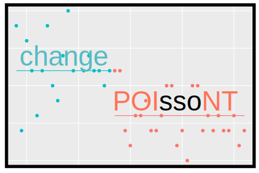

<!-- README.md is generated from README.Rmd. Please edit that file -->


# changePOIssoNT 


## Overview

changePOIssoNT is a package for detecting changepoints in 1-dimensional poisson count data.


```r
summary(cars)
#>      speed           dist       
#>  Min.   : 4.0   Min.   :  2.00  
#>  1st Qu.:12.0   1st Qu.: 26.00  
#>  Median :15.0   Median : 36.00  
#>  Mean   :15.4   Mean   : 42.98  
#>  3rd Qu.:19.0   3rd Qu.: 56.00  
#>  Max.   :25.0   Max.   :120.00
```

## Function Dependencies

Below is a network graph illustrating the dependencies of all functions in `changePOIssoNT`


```
#> 
#> Attaching package: 'shinydashboard'
#> The following object is masked from 'package:graphics':
#> 
#>     box
```

<!--html_preserve--><div id="htmlwidget-6de8e551578a10a94616" style="width:672px;height:480px;" class="visNetwork html-widget"></div>
<script type="application/json" data-for="htmlwidget-6de8e551578a10a94616">{"x":{"nodes":{"id":["1"],"label":["skellamLR"]},"edges":{"from":[],"to":[]},"nodesToDataframe":true,"edgesToDataframe":true,"options":{"width":"100%","height":"100%","nodes":{"shape":"dot"},"manipulation":{"enabled":false},"edges":{"arrows":"from"},"interaction":{"dragNodes":true},"physics":{"solver":"repulsion","stabilization":{"enabled":false,"iterations":5000,"onlyDynamicEdges":false}}},"groups":null,"width":null,"height":null,"idselection":{"enabled":true,"style":"width: 150px; height: 26px","useLabels":true},"byselection":{"enabled":false,"style":"width: 150px; height: 26px","multiple":false,"hideColor":"rgba(200,200,200,0.5)"},"main":null,"submain":null,"footer":null,"background":"rgba(0, 0, 0, 0)","highlight":{"enabled":true,"hoverNearest":false,"degree":1,"algorithm":"all","hideColor":"rgba(200,200,200,0.5)","labelOnly":true},"collapse":{"enabled":false,"fit":false,"resetHighlight":true,"clusterOptions":null},"tooltipStay":300,"tooltipStyle":"position: fixed;visibility:hidden;padding: 5px;white-space: nowrap;font-family: verdana;font-size:14px;font-color:#000000;background-color: #f5f4ed;-moz-border-radius: 3px;-webkit-border-radius: 3px;border-radius: 3px;border: 1px solid #808074;box-shadow: 3px 3px 10px rgba(0, 0, 0, 0.2);"},"evals":[],"jsHooks":[]}</script><!--/html_preserve-->


